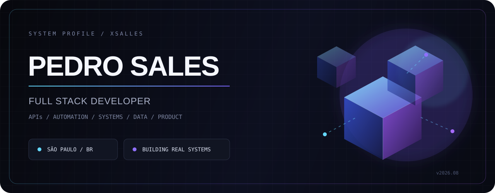
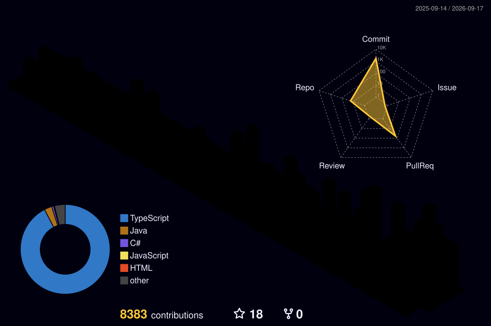
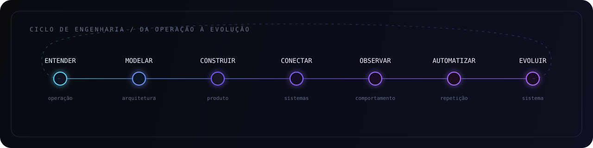

<!--
  Pedro Sales / GitHub Profile
  Designed as a technical interface, not a badge wall.
-->

<p align="center">
  
</p>

<p align="center">
  <a href="https://salles.dev.br"><strong>PORTFOLIO</strong></a>
  &nbsp;&nbsp;·&nbsp;&nbsp;
  <a href="https://linkedin.com/in/pedro-sales-00090a274"><strong>LINKEDIN</strong></a>
  &nbsp;&nbsp;·&nbsp;&nbsp;
  <a href="mailto:xs.salles@gmail.com"><strong>EMAIL</strong></a>
</p>

<p align="center">
  
</p>

<br />

## PROFILE / 01

```ts
const pedro = {
  role: "Full Stack Developer",
  location: "São Paulo, Brazil",
  current: "Desenvolvedor de Sistemas Júnior",
  studies: ["Sistemas de Informação", "Desenvolvimento de Sistemas"],
  builds: [
    "web applications",
    "REST APIs",
    "automation workflows",
    "internal systems",
    "scrapers",
    "dashboards"
  ],
  principle: "software should reduce friction, not create more of it"
};
```

Desenvolvo sistemas pensando no fluxo inteiro: regra de negócio, arquitetura, banco, API, interface, automação, deploy e manutenção.

Minha atuação hoje é menos sobre “uma stack específica” e mais sobre conectar tecnologia com operação real. Trabalho com sistemas internos, integrações, dados, automações, APIs, dashboards e aplicações web que precisam funcionar fora do ambiente de demonstração.

<br />

## CURRENT / 02

<table>
  <tr>
    <td width="25%"><strong>ROLE</strong></td>
    <td>Desenvolvedor de Sistemas Júnior</td>
  </tr>
  <tr>
    <td><strong>COMPANY</strong></td>
    <td>Kiraly Advocacia</td>
  </tr>
  <tr>
    <td><strong>DEGREE</strong></td>
    <td>Sistemas de Informação — Impacta</td>
  </tr>
  <tr>
    <td><strong>TECHNICAL</strong></td>
    <td>Desenvolvimento de Sistemas — SENAI Suíço-Brasileira</td>
  </tr>
  <tr>
    <td><strong>BASE</strong></td>
    <td>São Paulo, SP — Brasil</td>
  </tr>
</table>

<br />

## SYSTEMS I BUILD / 03

<table>
  <tr>
    <td width="33%" valign="top">
      <strong>AUTOMATION</strong><br/><br/>
      Workflows, webhooks, integrações, jobs, sincronizações e redução de processos manuais.
    </td>
    <td width="33%" valign="top">
      <strong>BACKEND</strong><br/><br/>
      APIs REST, autenticação, regras de negócio, persistência, integrações externas e serviços.
    </td>
    <td width="33%" valign="top">
      <strong>PRODUCT</strong><br/><br/>
      Dashboards, sistemas administrativos, aplicações web responsivas e interfaces orientadas a dados.
    </td>
  </tr>
</table>

<br />

## STACK / 04

<p align="center">
  
</p>

<p align="center">
  
</p>

<p align="center">
  <code>n8n</code>&nbsp;&nbsp;
  <code>REST APIs</code>&nbsp;&nbsp;
  <code>Webhooks</code>&nbsp;&nbsp;
  <code>Web Scraping</code>&nbsp;&nbsp;
  <code>PowerShell</code>&nbsp;&nbsp;
  <code>SQL</code>&nbsp;&nbsp;
  <code>CI/CD</code>
</p>

<br />

## SELECTED WORK / 05

<table>
  <tr>
    <td width="50%" valign="top">
      <strong>salles.dev</strong><br/>
      Portfólio pessoal e hub dos meus projetos.<br/><br/>
      <a href="https://salles.dev.br">salles.dev.br</a>
    </td>
    <td width="50%" valign="top">
      <strong>DevTrack</strong><br/>
      Projeto público focado em produto e desenvolvimento full stack.<br/><br/>
      <a href="https://github.com/xsalles/devtrack">github.com/xsalles/devtrack</a>
    </td>
  </tr>
  <tr>
    <td valign="top">
      <strong>Auth .NET API</strong><br/>
      Backend em .NET com foco em autenticação e arquitetura de API.<br/><br/>
      <a href="https://github.com/xsalles/auth-dotnet-api">github.com/xsalles/auth-dotnet-api</a>
    </td>
    <td valign="top">
      <strong>Inventory Management — Spring</strong><br/>
      Backend em Java/Spring voltado a gerenciamento de inventário.<br/><br/>
      <a href="https://github.com/xsalles/inventory-management-spring">github.com/xsalles/inventory-management-spring</a>
    </td>
  </tr>
  <tr>
    <td valign="top">
      <strong>Inventrix</strong><br/>
      Interface web para solução de inventário.<br/><br/>
      <a href="https://github.com/xsalles/inventrix-frontEnd">github.com/xsalles/inventrix-frontEnd</a>
    </td>
    <td valign="top">
      <strong>Movie App</strong><br/>
      Aplicação web pública construída como produto completo de estudo e evolução técnica.<br/><br/>
      <a href="https://github.com/xsalles/movie-app">github.com/xsalles/movie-app</a>
    </td>
  </tr>
</table>

<br />

## CONTRIBUTION SPACE / 06

<p align="center">
  
</p>

<p align="center">
  <sub>generated automatically from my GitHub contribution history</sub>
</p>

<br />

## ENGINEERING MODE / 07

<p align="center">
  
</p>

<br />

## PRINCIPLES / 08

```text
01  understand the operation before touching the architecture
02  remove unnecessary complexity
03  automate repetitive work
04  keep observability close to the product
05  design for maintenance, not only delivery
06  measure what matters
07  improve the system after it works
```

<br />

## CONTACT / 09

Se você quer conversar sobre sistemas, automação, integrações, produto ou engenharia de software:

**Portfolio** — https://salles.dev.br  
**LinkedIn** — https://linkedin.com/in/pedro-sales-00090a274  
**Email** — xs.salles@gmail.com

<br />

<p align="center">
  
</p>
