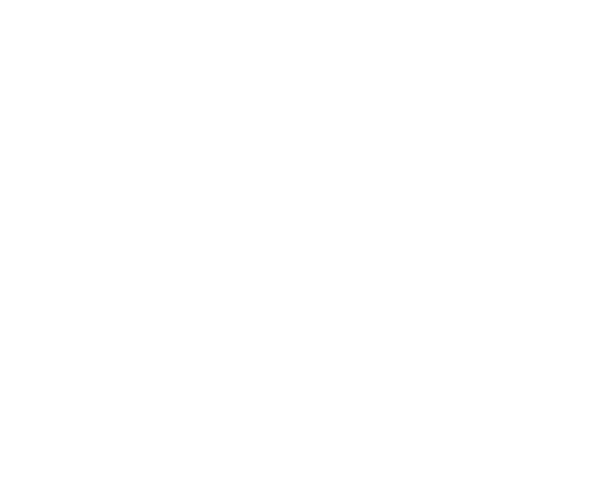
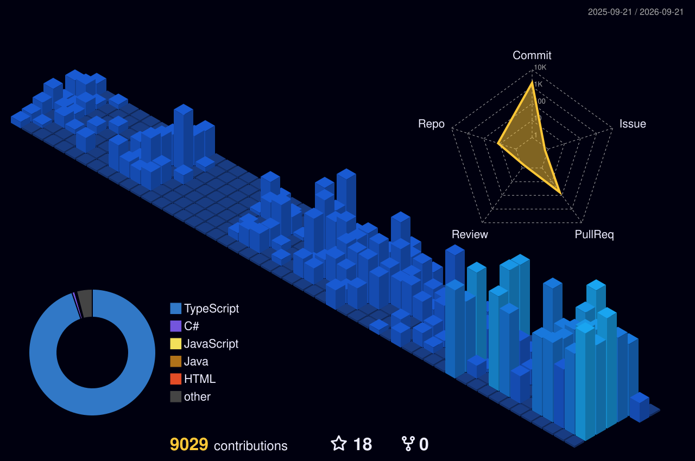

  <picture>
    <source media="(prefers-color-scheme: dark)" srcset="./assets/logo.svg">
    <source media="(prefers-color-scheme: light)" srcset="./assets/logo-light.svg">
    
  </picture>

  <h1>Pedro Henrique Moreira Sales</h1>
  
<strong>Desenvolvedor Full Stack</strong> · São Paulo, SP — Brasil

  
Construo sistemas reais, úteis e escaláveis, conectando produto, automação, APIs, dados e experiência de uso.

  

    
    
    
    
  

<h2>Sobre mim:</h2>

<table width="100%">
  <tr>
    <td width="62%" valign="top">
      
Sou desenvolvedor Full Stack e gosto de trabalhar no problema inteiro: regra de negócio, arquitetura, banco de dados, API, interface, automação, deploy e manutenção.

      
Minha atuação hoje é voltada para sistemas internos, integrações, automações, dashboards, web scraping e aplicações que precisam funcionar de verdade dentro da operação.

      
Busco construir software com menos complexidade desnecessária, melhor observabilidade e espaço para evolução contínua.

    </td>
    <td width="38%" valign="top">
      <strong>Foco atual</strong>  
      <code>Desenvolvimento Full Stack</code> 
      <code>Automação</code> 
      <code>APIs e integrações</code> 
      <code>Arquitetura de sistemas</code> 
      <code>Dados e dashboards</code> 
      <code>Performance e manutenção</code>
    </td>
  </tr>
</table>

<table width="100%">
  <tr>
    <td width="33%" align="center"><strong>São Paulo, SP</strong> Brasil</td>
    <td width="33%" align="center"><strong>Sistemas de Informação</strong> Impacta · 2026–2029</td>
    <td width="33%" align="center"><strong>Desenvolvimento de Sistemas</strong> SENAI Suíço-Brasileira</td>
  </tr>
</table>

<h2>Atualmente:</h2>

<table width="100%">
  <tr>
    <td width="50%" valign="top">
      <h3>Kiraly Advocacia</h3>
      
<strong>Desenvolvedor de Sistemas Júnior</strong>

      
Desenvolvimento e evolução de sistemas internos, automações, integrações, APIs, dashboards e infraestrutura de apoio à operação.

      
<code>n8n</code> <code>Python</code> <code>PostgreSQL</code> <code>APIs REST</code> <code>Dolibarr</code>

    </td>
    <td width="50%" valign="top">
      <h3>FoodBridge</h3>
      
<strong>Front-end Developer</strong>

      
Desenvolvimento da interface, experiência do usuário e evolução do produto com foco em organização, responsividade e manutenção.

      
<code>React</code> <code>Next.js</code> <code>TypeScript</code> <code>TailwindCSS</code>

    </td>
  </tr>
</table>

<h2>Tecnologias:</h2>

<table width="100%">
  <tr>
    <td width="50%" valign="top">
      <h3>Front-end</h3>
      

      
<code>React</code> <code>Next.js</code> <code>Angular</code> <code>TypeScript</code> <code>JavaScript</code> <code>TailwindCSS</code> <code>Sass</code>

    </td>
    <td width="50%" valign="top">
      <h3>Back-end</h3>
      

      
<code>Node.js</code> <code>NestJS</code> <code>Java</code> <code>Spring</code> <code>.NET</code> <code>Python</code> <code>REST APIs</code>

    </td>
  </tr>
  <tr>
    <td width="50%" valign="top">
      <h3>Banco de dados</h3>
      

      
<code>PostgreSQL</code> <code>MySQL</code> <code>Firebase</code> <code>SQL</code>

    </td>
    <td width="50%" valign="top">
      <h3>Ferramentas e DevOps</h3>
      

      
<code>Docker</code> <code>Git</code> <code>GitHub</code> <code>Linux</code> <code>Vercel</code> <code>Postman</code> <code>n8n</code> <code>CI/CD</code>

    </td>
  </tr>
</table>

<h2>Projetos selecionados:</h2>

<table width="100%">
  <tr>
    <td width="50%" valign="top">
      <h3><a href="https://salles.dev.br">salles.dev.br</a></h3>
      
Meu portfólio pessoal, identidade profissional e hub dos principais projetos.

      
<code>Next.js</code> <code>TypeScript</code> <code>TailwindCSS</code>

    </td>
    <td width="50%" valign="top">
      <h3><a href="https://github.com/xsalles/devtrack">DevTrack</a></h3>
      
Projeto focado em produto e desenvolvimento full stack, organizado para evolução contínua.

      
<code>Full Stack</code> <code>Produto</code>

    </td>
  </tr>
  <tr>
    <td width="50%" valign="top">
      <h3><a href="https://github.com/xsalles/auth-dotnet-api">Auth .NET API</a></h3>
      
API em .NET com foco em autenticação, organização de backend e boas práticas de arquitetura.

      
<code>.NET</code> <code>REST API</code> <code>Auth</code>

    </td>
    <td width="50%" valign="top">
      <h3><a href="https://github.com/xsalles/inventory-management-spring">Gerenciamento de Inventário</a></h3>
      
Backend em Java/Spring voltado para gerenciamento de inventário e regras de negócio.

      
<code>Java</code> <code>Spring</code> <code>Backend</code>

    </td>
  </tr>
  <tr>
    <td width="50%" valign="top">
      <h3><a href="https://github.com/xsalles/inventrix-frontEnd">Inventrix</a></h3>
      
Interface web para solução de inventário, com foco em usabilidade e organização de dados.

      
<code>Front-end</code> <code>Web</code>

    </td>
    <td width="50%" valign="top">
      <h3><a href="https://github.com/xsalles/movie-app">Movie App</a></h3>
      
Aplicação web pública construída como ambiente de estudo e evolução técnica.

      
<code>Web</code> <code>API</code> <code>UI</code>

    </td>
  </tr>
</table>

<a href="https://github.com/xsalles?tab=repositories"><strong>Ver todos os projetos →</strong></a>

<h2>Espaço de contribuições:</h2>

  
   
  Gráfico gerado automaticamente a partir do meu histórico de contribuições no GitHub.

<h2>Meu fluxo de engenharia:</h2>

<table width="100%">
  <tr>
    <td width="25%" align="center"><strong>1. Entender</strong> Analisar o problema e a operação.</td>
    <td width="25%" align="center"><strong>2. Modelar</strong> Estruturar a solução e os dados.</td>
    <td width="25%" align="center"><strong>3. Construir</strong> Implementar com código simples.</td>
    <td width="25%" align="center"><strong>4. Testar</strong> Validar comportamento e cenários.</td>
  </tr>
  <tr>
    <td width="25%" align="center"><strong>5. Integrar</strong> Conectar serviços e sistemas.</td>
    <td width="25%" align="center"><strong>6. Observar</strong> Medir uso, erros e performance.</td>
    <td width="25%" align="center"><strong>7. Automatizar</strong> Eliminar repetição operacional.</td>
    <td width="25%" align="center"><strong>8. Evoluir</strong> Refatorar, simplificar e melhorar.</td>
  </tr>
</table>

<table width="100%">
  <tr>
    <td width="58%" valign="top">
      <h2>Princípios:</h2>
      <table width="100%">
        <tr>
          <td width="50%" valign="top"><strong>Foco</strong> Fazer menos, mas fazer bem.</td>
          <td width="50%" valign="top"><strong>Qualidade</strong> Estrutura, documentação e testes.</td>
        </tr>
        <tr>
          <td width="50%" valign="top"><strong>Eficiência</strong> Automatizar o que for repetitivo.</td>
          <td width="50%" valign="top"><strong>Evolução</strong> Aprender, construir e melhorar continuamente.</td>
        </tr>
      </table>
    </td>
    <td width="42%" valign="top">
      <h2>Contato:</h2>
      
Estou sempre aberto a conversar sobre projetos, oportunidades, automação, produto e engenharia de software.

      
<strong>Email:</strong> <a href="mailto:xs.salles@gmail.com">xs.salles@gmail.com</a>

      
<strong>LinkedIn:</strong> <a href="https://linkedin.com/in/pedro-sales-00090a274">pedro-sales-00090a274</a>

      
<strong>Portfólio:</strong> <a href="https://salles.dev.br">salles.dev.br</a>

    </td>
  </tr>
</table>

  <picture>
    <source media="(prefers-color-scheme: dark)" srcset="./assets/logo.svg">
    <source media="(prefers-color-scheme: light)" srcset="./assets/logo-light.svg">
    
  </picture>
  
<strong>Pedro Sales</strong> Desenvolvedor Full Stack · Construindo sistemas reais que geram valor.

